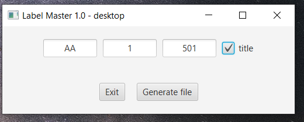
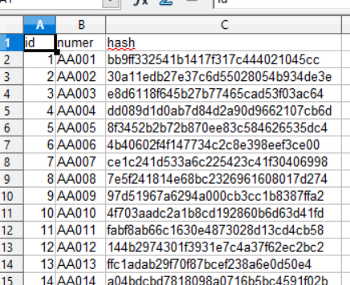

# LabelMaster1.0-Desktop
Desktop application to create a database of numbers and their cryptographic pair to be printed later on. Part of Label Master 1.0

Creates a CSV file with selected information. Those have to be converted into QR code and datamatrix code in a label software like  https://www.nicelabel.com/ , https://zebra.com or any other.

Such printed label can be checked with mobile application for complience, check:  https://github.com/PDymala/LabelMaster1.0-Android 

UI:

Example of generated database:

Not the best looking app but does it purpose :)

